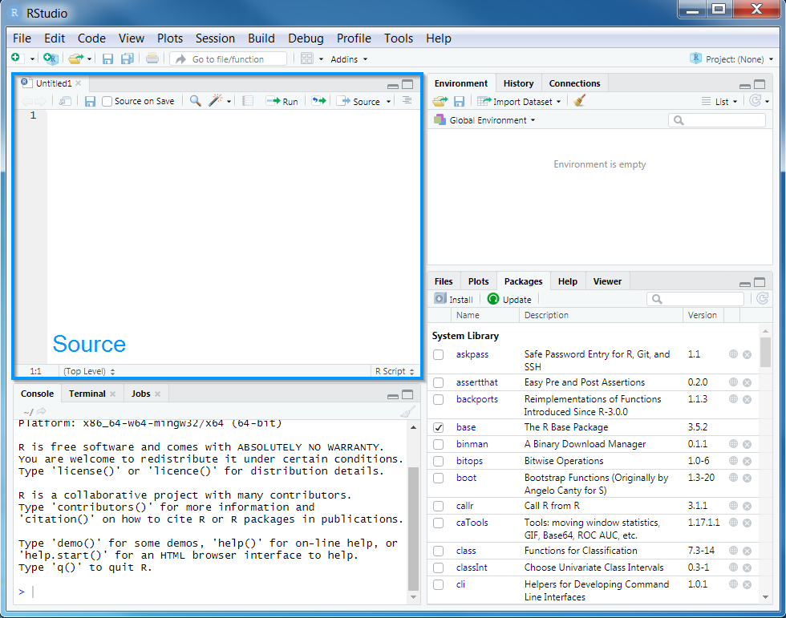

# Data {#data}

## Starting out

We will start by opening RStudio. Ideally, you will have already installed both R and Rstudio before the workshop. If you have not done this already, then please see the [Setting up your computer](#setup) section. **During this workshop, please do not copy and paste code from the workshop manual into RStudio. Instead, please write it out yourself in an R script.** When programming, you will spend a lot of time fixing coding mistakes---that is, debugging your code---so it is best to get used to making mistakes now when you have people here to help you. You can create a new R script by clicking on _File_ in the RStudio menu bar, then _New File_, and then _R Script_.

```{r, out.width = "70%", echo = FALSE}
knitr::include_graphics("images/rstudio-new-script.png")
```

After creating a new script, you will notice that a new _Source_ panel has appeared. In the _Source_ panel, you can type and edit code before you run it. You can run code in the _Source_ panel by placing the cursor (i.e. the blinking line) on the desired line of code and pressing `Control + Enter` on your keyboard (or `CMD + Enter` if you are using an Apple computer). You can save the code in the _Source_ panel by pressing `Control + s` on your keyboard (or `CMD + s` if you are using an Apple computer).

```{r, out.width = "70%", echo = FALSE}

```

You can also make notes and write your answers to the workshop questions inside the R script. When writing notes and answers, add a `#` symbol so that the text following the `#` symbol is treated as a comment and not code. This means that you don't have to worry about highlighting specific parts of the script to avoid errors.

```{r}
# this is a comment and R will ignore this text if you run it
# R will run the code below because it does not start with a # symbol
print("this is not a comment")

# you can also add comments to the same line of R code too
print("this is also not a comment") # but this is a comment
```

**Remember to save your script regularly to ensure that you don't lose anything in the event that RStudio crashes (e.g. using `Control + s` or `CMD + s`)!**

## Attaching packages

Now we will set up our R session for the workshop. Specifically, enter the following R code to attach the R packages used in this workshop.

```{r, message = FALSE, warning = FALSE}
# load packages
library(prioritizr)
library(sf)
library(rgdal)
library(raster)
library(rgeos)
require(mapview)
library(units)
library(scales)
library(assertthat)
library(gridExtra)
library(dplyr)
```

You should have already downloaded the data. If you have not already done so, you can [download it from here](https://github.com/prioritizr/massey-workshop/raw/master/data.zip). After downloading the data, you can unzip the data into a new folder. Next, you will need to set the working directory to this new folder. To achieve this, click on the _Session_ button on the RStudio menu bar, then click _Set Working Directory_, and then _Choose Directory_.

```{r, out.width = "70%", echo = FALSE}
knitr::include_graphics("images/rstudio-wd.png")
```

\clearpage

Now navigate to the folder where you unzipped the data and select _Open_. You can verify that you have correctly set the working directory using the following R code. You should see the output `TRUE` in the _Console_ panel.

```{r, include = FALSE}
if (!file.exists("data/pu.shp"))
  unzip("data.zip")
setwd("data")
```

```{r}
file.exists("data/pu.shp")
```

```{r, include = FALSE}
setwd("..")
```

## Data import

```{r, include = FALSE}
n_features <- raster::nlayers(raster::stack("data/vegetation.tif"))
```

Now that we have downloaded the dataset, we will need to import it into our R session. Specifically, this data was obtained from the "Introduction to Marxan" course and was originally a subset of a larger spatial prioritization project performed under contract to Australia’s Department of Environment and Water Resources. It contains vector-based planning unit data (`pu.shp`) and the raster-based data describing the spatial distributions of `r n_features` vegetation classes (`vegetation.tif`) in southern Tasmania, Australia. Please note this dataset is only provided for teaching purposes and should not be used for any real-world conservation planning. We can import the data into our R session using the following code.

```{r}
# import planning unit data
pu_data <- as(read_sf("data/pu.shp"), "Spatial")

# format columns in planning unit data
pu_data$locked_in <- as.logical(pu_data$locked_in)
pu_data$locked_out <- as.logical(pu_data$locked_out)

# import vegetation data
veg_data <- stack("data/vegetation.tif")
```

```{r, include = FALSE}
assert_that(sum(pu_data$locked_in) > 0, sum(pu_data$locked_out) > 0,
            sum(pu_data$locked_in & pu_data$locked_out) == 0)
```

\clearpage

## Planning unit data

The planning unit data contains spatial data describing the geometry for each planning unit and attribute data with information about each planning unit (e.g. cost values). Let's investigate the `pu_data` object. The attribute data contains `r ncol(pu_data)` columns with contain the following information:

* `id`: unique identifiers for each planning unit
* `cost`: acquisition cost values for each planning unit (millions of Australian dollars).
* `status`: status information for each planning unit (only relevant with Marxan)
* `locked_in`: logical values (i.e. `TRUE`/`FALSE`) indicating if planning units are covered by protected areas or not.
* `locked_out`: logical values (i.e. `TRUE`/`FALSE`) indicating if planning units cannot be managed as a protected area because they contain are too degraded.

```{r}
# print a short summary of the data
print(pu_data)

# plot the planning unit data
plot(pu_data)
```

```{r, eval = FALSE}
# plot an interactive map of the planning unit data
mapview(pu_data)
```

```{r, out.width = "60%"}
# print the structure of object
str(pu_data, max.level = 2)

# print the class of the object
class(pu_data)

# print the slots of the object
slotNames(pu_data)

# print the coordinate reference system
print(pu_data@proj4string)

# print number of planning units (geometries) in the data
nrow(pu_data)

# print the first six rows in the data
head(pu_data@data)

# print the first six values in the cost column of the attribute data
head(pu_data$cost)

# print the highest cost value
max(pu_data$cost)

# print the smallest cost value
min(pu_data$cost)

# print average cost value
mean(pu_data$cost)

# plot a map of the planning unit cost data
spplot(pu_data, "cost")
```

```{r, eval = FALSE}
# plot an interactive map of the planning unit cost data
mapview(pu_data, zcol = "cost")
```

Now, you can try and answer some questions about the planning unit data.

```{block2, type="rmdquestion"}
1. How many planning units are in the planning unit data?
2. What is the highest cost value?
3. Is there a spatial pattern in the planning unit cost values (hint: use `plot` to make a map)?

```

\clearpage

## Vegetation data

The vegetation data describe the spatial distribution of `r n_features` vegetation classes in the study area. This data is in a raster format and so the data are organized using a grid comprising square grid cells that are each the same size. In our case, the raster data contains multiple layers (also called "bands") and each layer has corresponds to a spatial grid with exactly the same area and has exactly the same dimensionality (i.e. number of rows, columns, and cells). In this dataset, there are `r n_features` different regular spatial grids layered on top of each other -- with each layer corresponding to a different vegetation class -- and each of these layers contains a grid with `r raster::nrow(veg_data)` rows, `r raster::ncol(veg_data)` columns, and `r nrow(veg_data) * ncol(veg_data)` cells. Within each layer, each cell corresponds to a `r raster::xres(veg_data)/1000` by `r raster::yres(veg_data)/1000` km square. The values associated with each grid cell indicate the (one) presence or (zero) absence of a given vegetation class in the cell.


Let's explore the vegetation data.

```{r "explore feature data"}
# print a short summary of the data
print(veg_data)

# plot a map of the 20th vegetation class
plot(veg_data[[20]])
```

```{r, eval = FALSE}
# plot an interactive map of the 20th vegetation class
mapview(veg_data[[20]])
```

```{r "preview feature data"}
# print number of rows in the data
nrow(veg_data)

# print number of columns  in the data
ncol(veg_data)

# print number of cells in the data
ncell(veg_data)

# print number of layers in the data
nlayers(veg_data)

# print  resolution on the x-axis
xres(veg_data)

# print resolution on the y-axis
yres(veg_data)

# print spatial extent of the grid, i.e. coordinates for corners
extent(veg_data)

# print the coordinate reference system
print(veg_data@crs)

# print a summary of the first layer in the stack
print(veg_data[[1]])

# print the value in the 800th cell in the first layer of the stack
print(veg_data[[1]][800])

# print the value of the cell located in the 30th row and the 60th column of
# the first layer
print(veg_data[[1]][30, 60])

# calculate the sum of all the cell values in the first layer
cellStats(veg_data[[1]], "sum")

# calculate the maximum value of all the cell values in the first layer
cellStats(veg_data[[1]], "max")

# calculate the minimum value of all the cell values in the first layer
cellStats(veg_data[[1]], "min")

# calculate the mean value of all the cell values in the first layer
cellStats(veg_data[[1]], "mean")
```

\clearpage

Now, you can try and answer some questions about the vegetation data.

```{block2, type="rmdquestion"}
1. What part of the study area is the 13th vegetation class found in (hint: make a map)? For instance, is it in the south-eastern part of the study area?
2. What proportion of cells contain the 12th vegetation class?
3. Which vegetation class is the most abundant (i.e. present in the greatest number of cells)?

```

```{r, include = FALSE}
sum_veg_data <- sum(veg_data)
```
